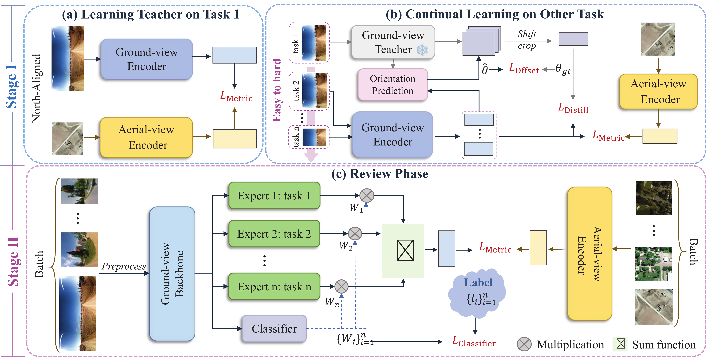
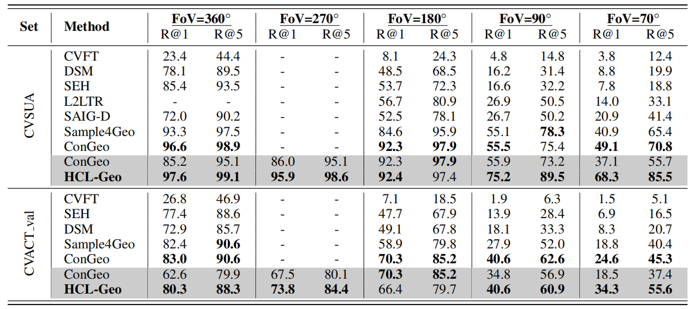
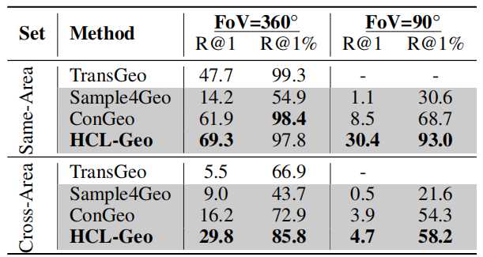

## 🏆 Official Implementation of “First Learn, Then Review: Human-like Continual Learning for Cross-View Geo-localization with Limited Field of View” (AAAI 2026)
🎉 **Congratulations!**  
Our paper **“First Learn, Then Review: Human-like Continual Learning for Cross-View Geo-localization with Limited Field of View”** has been **accepted to AAAI 2026 (Main Technical Track)**!  

---

🧠 **Method**

<p align="center">
  
</p>

---

📊 **Results**
<p align="center">
  
</p>
<p align="center">
  
</p>
<p align="center">
  
</p>

---

🚀 **Training**

To reproduce our training procedure:

```
sh ./train_cvusa.sh
sh ./train_cvact.sh
sh ./train_vigor.sh
```

---

🙏 **Acknowledgements & Citation**

```
@inproceedings{deuser2023sample4geo,
  title={Sample4geo: Hard negative sampling for cross-view geo-localisation},
  author={Deuser, Fabian and Habel, Konrad and Oswald, Norbert},
  booktitle={Proceedings of the IEEE/CVF International Conference on Computer Vision},
  pages={16847--16856},
  year={2023}
}
@inproceedings{mi2025congeo,
  title={Congeo: Robust cross-view geo-localization across ground view variations},
  author={Mi, Li and Xu, Chang and Castillo-Navarro, Javiera and Montariol, Syrielle and Yang, Wen and Bosselut, Antoine and Tuia, Devis},
  booktitle={European Conference on Computer Vision},
  pages={214--230},
  year={2025},
  organization={Springer}
}
```
